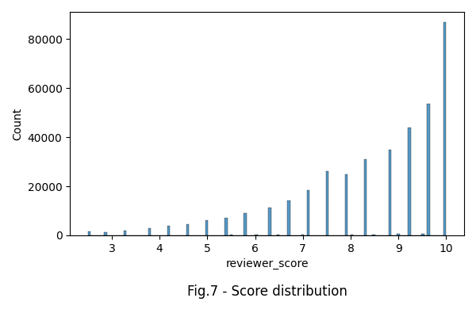
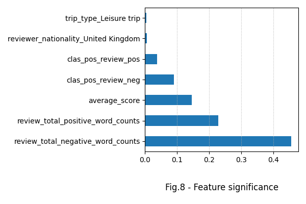
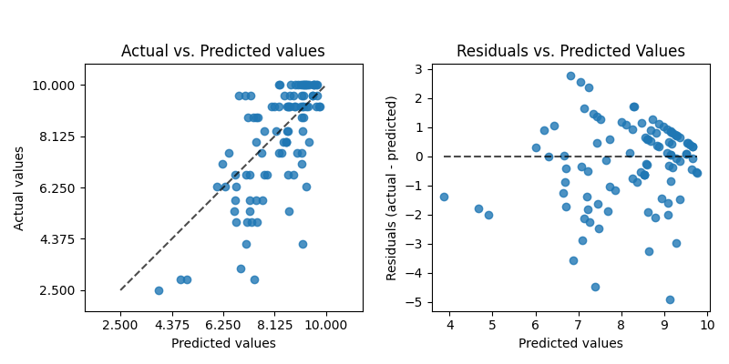

# Hotel rating fraud detection


## Content

* [Summary](README.md#Summary)  
* [Project description](README.md#Project-description)  
* [Data and methods](README.md#Data-and-methods)                                
* [Project structure](README.md#Project-structure)                   


---

## Summary

It was created a machine learning model to predict hotel ratings basing on their properties. Customers feedbacks tone were analyzed using the Textblob library for better rating estimation. 

## Project description

Booking.com is a world-leading digital platform in a hospitality sector. It services travellers and connects them with hotels of various kinds. 

<p align="center">  </p>

One of the platform's problem is a fraud in the hotel ratings: some hotels increase its rating without improving service quality. It results in the following consequences: 

* credibility loss of the Booking.com, 
* low profits of those hotels which really improved its service quality
* low travelling customers satisfation in general.

So it was decided to create the model, predicting hotel rating from users feedbacks and compare it with the rating, provided by the hotel.

## Data and methods

The original dataset contains about 385.000 entries. Due to large size of the data base exceeding the GitHub' s filesize limit of 25 mb, it is stored and downloaded from the [Kaggle website](https://www.kaggle.com/competitions/sf-booking/data). 

First goal is to predict score by given features and compare it with original score set. Scores are unevenly distribute in the range from 0 to 10; they are concentrating around integer values.

<div align="center">   </div>

Features were ranged by its significance in relation to the score.

<div align="center">   </div>

The model was cross-validated to get better estimation.

<div align="center">   </div>

:arrow_up:[ to content](README.md#Content)


## Project structure

<details>
  <summary>display project structure </summary>

```Python
Hotel-rating-fraud-detection
├── .gitignore
├── config              # configuration parameters
│   └── data_config.json     
├── data                # data archive
│   └── hotels.zip      
├── figures             # figures
│   ├── fig_1.png
......
│   └── fig_9.png
├── models              # models storage
│   ├── models.py
│   └── __ init __.py
├── notebooks           # project notebooks storage
│   └── Project-3_v3.ipynb
├── README.md
├── requirements.txt
└── utils
    ├── functions.py
    └── __ init __.py

```
</details>